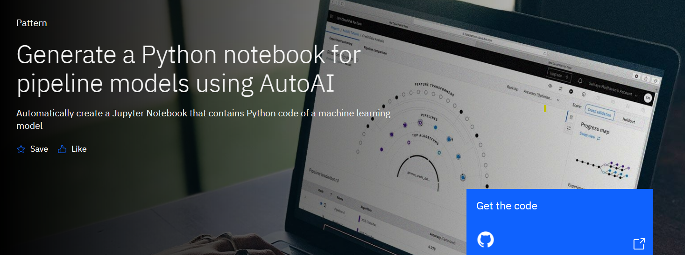

# Project-Capstone-HCAI

## Infinite Learning ##

Red Hat Certified System Administrator - IBM AI &amp; Cybersecurity. 

| Keterangan| Data                             |
| --------- | ----                             |
| Nama      | Muhammad Rafli                   |
| Asal      | Jakarta                          |
| Kampus    | Politeknik Negeri Semarang       |
| Jurusan   | Teknik Eletro                    |
| Prodi     | D4 - Teknologi Rekayasa Komputer |

## Keterangan Projek ##

### Dataset Lung Cancer
Dataset ini diambil dari website kaggle, link = https://www.kaggle.com/datasets/mysarahmadbhat/lung-cancer

2. Pattern yang dipakai dari IBM Developer AI
   

3. Flow
   
1. Pengguna mengirimkan percobaan AutoAI menggunakan pengaturan default.
2. Beberapa model pipeline dihasilkan. Model pipeline pilihan dari papan peringkat disimpan sebagai buku catatan Jupyter.
3. Notebook Jupyter dijalankan dan model pipeline yang dimodifikasi dibuat di dalam notebook.
4. Model pipeline digunakan di Watson Machine Learning menggunakan API WML.
