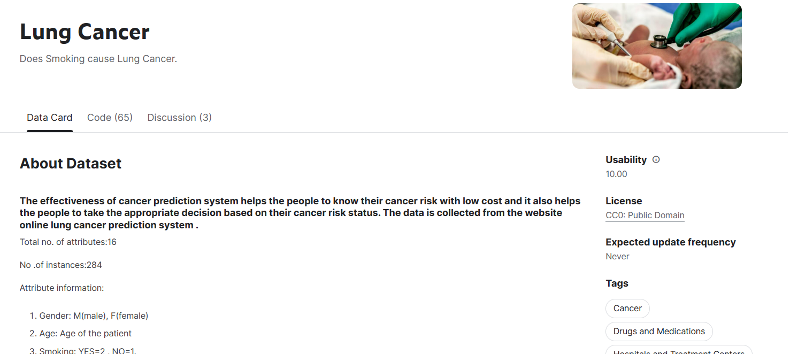
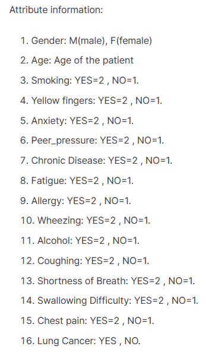
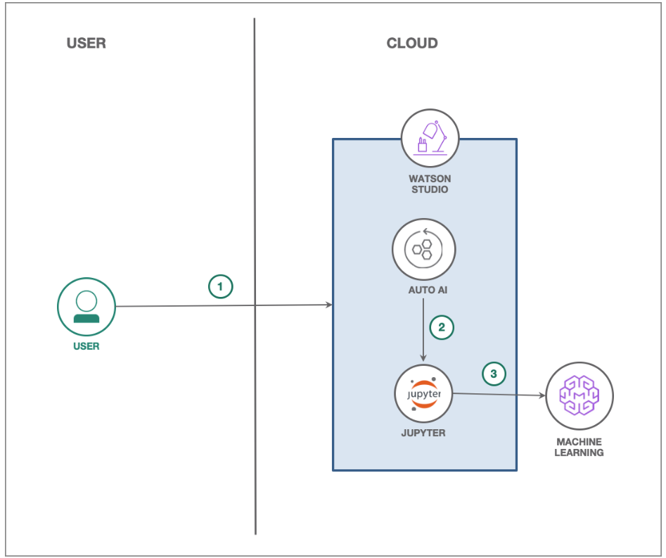
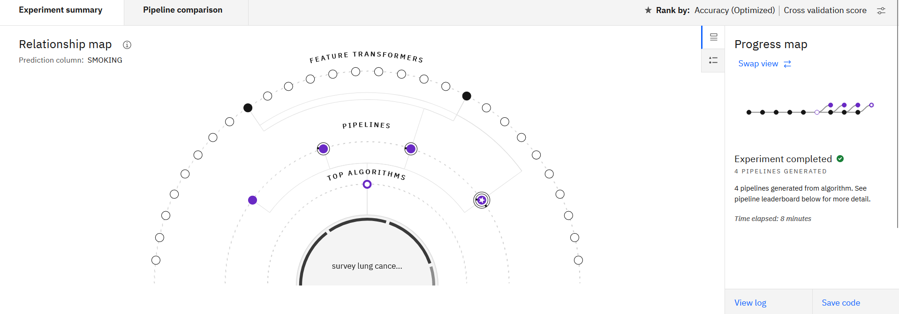
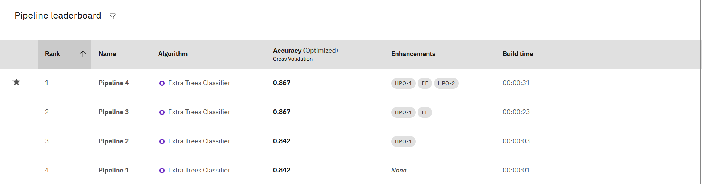
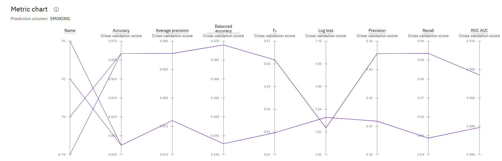
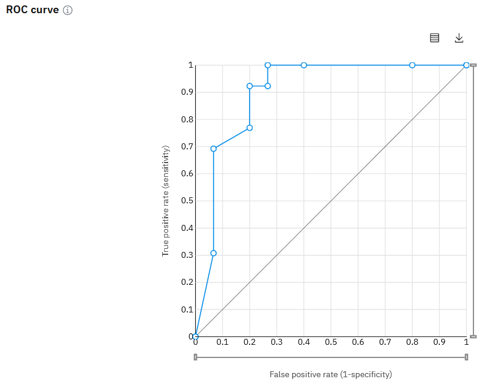
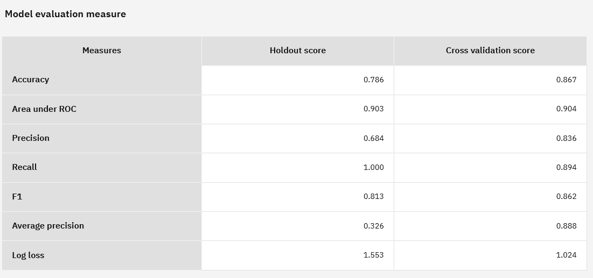
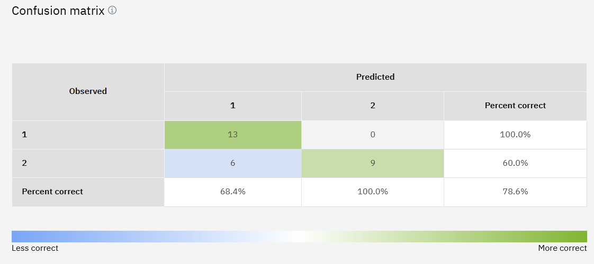

# Project-Capstone-HCAI

## Infinite Learning ##

Red Hat Certified System Administrator - IBM AI &amp; Cybersecurity. 

| Keterangan| Data                             |
| --------- | ----                             |
| Nama      | Muhammad Rafli                   |
| Asal      | Jakarta                          |
| Kampus    | Politeknik Negeri Semarang       |
| Jurusan   | Teknik Eletro                    |
| Prodi     | D4 - Teknologi Rekayasa Komputer |

## Keterangan Projek ##

### Dataset Lung Cancer
Dataset ini diambil dari website kaggle, link = https://www.kaggle.com/datasets/mysarahmadbhat/lung-cancer

### Pattern yang dipakai dari IBM Developer AI
   

### Flow

1. Pengguna mengirimkan percobaan AutoAI menggunakan pengaturan default.
2. Beberapa model pipeline dihasilkan. Model pipeline pilihan dari papan peringkat disimpan sebagai buku catatan Jupyter.
3. Notebook Jupyter dijalankan dan model pipeline yang dimodifikasi dibuat di dalam notebook.
4. Model pipeline digunakan di Watson Machine Learning menggunakan API WML.

## Komponen

* [IBM Watson Studio](https://cloud.ibm.com/catalog/services/watson-studio) 
* [IBM Watson Machine Learning](https://cloud.ibm.com/catalog/services/machine-learning) 

## Hasil 

## Kesimpulan 

Berdasarkan hasil Predict Lung Cancer effect Smoking with pipeline models using AutoAI, dapat disimpulkan bahwa:

+ Algoritma yang digunakan adalah Extra Trees Classifier. Algoritma ini telah terbukti efektif dalam memprediksi efek merokok terhadap kanker paru-paru.

+ Model yang dikembangkan dengan menggunakan algoritma tersebut mencapai tingkat akurasi sebesar 0.867. Angka ini menunjukkan bahwa model memiliki kemampuan yang baik dalam mengklasifikasikan efek merokok terhadap kanker paru-paru.

+ Dilakukan beberapa peningkatan (enhancements) pada model, yaitu 1st dan 2nd Hyperparameter Optimization serta Feature Engineering. Peningkatan ini membantu meningkatkan performa model dengan mengoptimalkan parameter dan mengubah fitur yang digunakan.

Dengan hasil tersebut, studi ini memberikan pemahaman yang lebih baik tentang hubungan antara merokok dan kanker paru-paru. Model yang dikembangkan memiliki tingkat akurasi yang tinggi dan telah mengalami peningkatan melalui proses optimisasi parameter dan rekayasa fitur. Implikasinya, model ini dapat digunakan sebagai alat yang berguna dalam memprediksi dan memahami dampak merokok terhadap kesehatan paru-paru.
